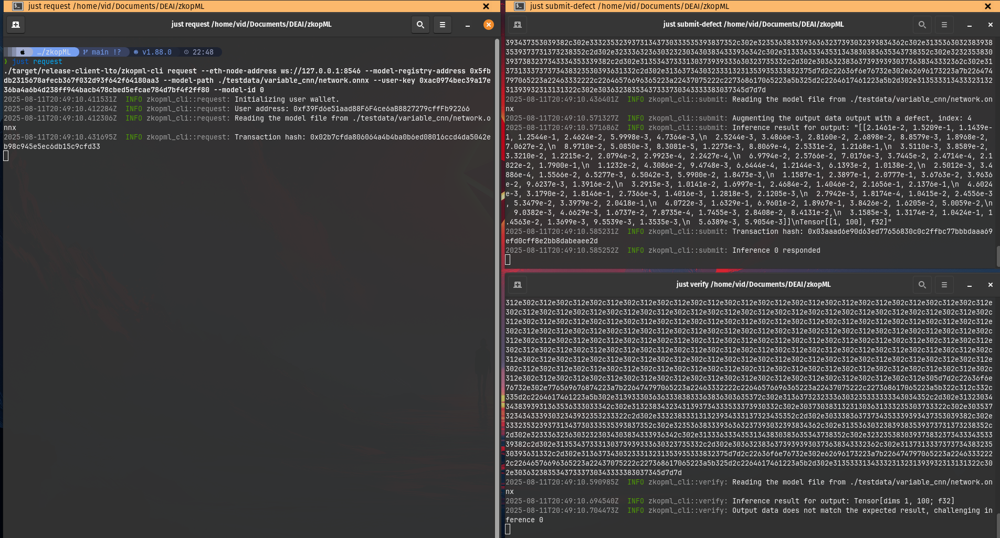

# zk-OPML

This repository contains the source code for the article "zk-OPML: Using Zero-Knowledge Proofs to Optimize OPML." zk-OPML is a novel method for achieving verifiability of machine learning model inference, leveraging crypto-economic and cryptographic principles. The repository includes everything needed to set up a local environment and reproduce the experiments presented in the article.

## Method Description

zk-OPML builds on the principles of Optimistic Machine Learning (OPML) and Zero-Knowledge Machine Learning (ZKML), combining the strengths of both approaches to achieve greater efficiency, scalability, and performance. By leveraging the interactive verification of OPML together with the cryptographic guarantees of ZKML, the protocol introduces a hybrid model that balances practical feasibility with strong security assurances.

At a high level, the protocol works as follows: a user submits a machine learning inference request through a smart contract call, and submitters respond by providing inference results. Challengers monitor these results and can raise a dispute if they believe an output is incorrect. Once a challenge is opened, the Fault Dispute Game (FDG) is played between the submitter and challenger over the sequence of ONNX operators that define the ML model. The binary search process narrows the disagreement to a specific ONNX operator (or group of operators). At this point, a zero-knowledge proof (ZKP) is generated for the disputed operator’s execution and verified on-chain, ensuring that the computation was performed correctly.

## Project Structure

The project is structured in the following way:

- `contracts`: smart contracts for the ML model registry, fault disoute game (FDG), and library for SP1 ZKVM on-chain verifier
- `crates`: common code in Rust, SP1 ZKVM program
- `bin`: source code for binaries, CLI
- `testdata`: test ML models and data for development and testing

## Prerequisites

1. [Rust v1.88.0](https://www.rust-lang.org/tools/install)
2. [Python 3.10.12](https://www.python.org/)
3. [just](https://just.systems/man/en/)
4. [Docker](https://www.docker.com/)
5. [SP1 ZKVM](https://docs.succinct.xyz/docs/sp1/introduction)
6. [Foundry](https://getfoundry.sh/)

## Usage

First, build the code:

```bash
just build
```

Then we need to setup the development environment (local Ethereum network and IPFS) and deploy all needed smart contracts:

```bash
just setup-network # ethereum, IPFS
just deploy-create2 # create2 smart contract
just deploy-sp1-verifier # SP1 on-chain verifier
just deploy-smart-contracts # ML model registry, FDG smart contract
```

Before starting the zk-OPML, we need to set a few environment variables. Even though testing is performed on the local Ethereum devnet, the SP1 ZKVM proof generation requests are sent to the [Succinct Prover Network](https://docs.succinct.xyz/docs/sp1/prover-network/quickstart). For more information on how to use the prover network, check the provided link. You need to configure your `.env` file with the following variables (check `.env.example`):

```bash
# ML model
MODEL_PATH=<path-to-the-testing-ml-model> # check the folder testdata for all ML models that were tested; this model will be used everywhere
INPUT_DATA_PATH=<path-to-the-input-data>

# Smart contracts
MODEL_REGISTRY_SMART_CONTRACT=<model-registry-smart-contract-address> # check the output of just deploy-smart-contracts
FDG_SMART_CONTRACT=<fdg-smart-contract-address> # check the output of just deploy-smart-contracts

# SP1 prover network
NETWORK_PRIVATE_KEY=<private-key-for-succinct-prover-network>
NETWORK_RPC_URL=<rpc-url-for-succinct-prover-network>
```

After everything is set up, we can first start with registering the ML model to the model registry smart contract:

```bash
just register
```

To test the fault proof game, you need to open three terminal windows and run all three participating entities in the following order:

| **Actor**        | **Command**                                   | **Command Parameters**           | **Description**                                         |
|:-----------------|:----------------------------------------------|:---------------------------------|:--------------------------------------------------------|
| Submitter        | `just submit 0` or `just submit-defect 0 2`   | `0`: `model id`, `2`: `defect operator` | Responds with ML inference                              |
| Verifier         | `just verify 0`                               | `0`: `model id`                    | Verifies the ML inference and can create a challenge     |
| User/Requester   | `just request 0`                              | `0`: `model id`                    | Requests ML inference                                   |

> **Notes:**  
> The `model id` is an incremental counter assigned to each registered model. The first registered model receives `model id` 0, the next one 1, and so on.
> The `defect operator` refers to the ONNX operator index where the submitter intentionally corrupts the inference (for testing purposes), allowing the verifier to create a successfull challenge.



To shutdown the development environment:

```bash
just shutdown-network
```

## ML Models

The following ML models are available in the `testdata` directory:

- `testdata/lenet`: LeNet convolutional neural network
- TODO
- TODO
- TODO

To use a specific model, set the variable `MODEL_PATH` in the `.env` to the location of the model's ONNX file.

## Results

TODO

## License

MIT License - see [LICENSE](LICENSE) file for details.

## Article

TODO

## Acknowledgments

- [Alloy](https://github.com/alloy-rs/alloy) - Ethereum Rust library
- [Foundry](https://github.com/foundry-rs/foundry) - Ethereum smart contract development and testing
- [SP1](https://github.com/succinctlabs/sp1) - Zero-knowledge virtual machine (ZKVM)
- [OPML](https://github.com/ora-io/opml) - Optimistic machine learning (OPML)
- [EZKL](https://github.com/zkonduit/ezkl) - Zero-knowledge machine learning (ZKML)
- [Candle ONNX](https://github.com/huggingface/candle/tree/main/crates/candle-onnx) - ONNX runtime for Rust

## Author's Contact

- Twitter: [@vidkersic](https://twitter.com/vidkersic)
- Email: [vid.kersic@yahoo.com](mailto:vid.kersic@yahoo.com)
